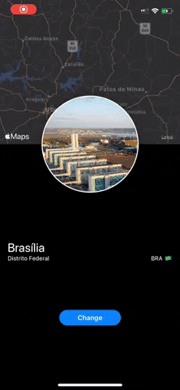
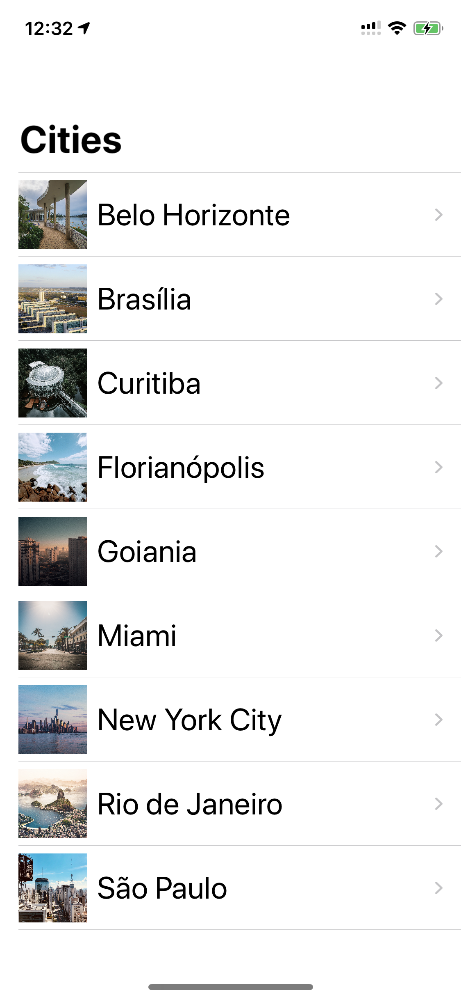
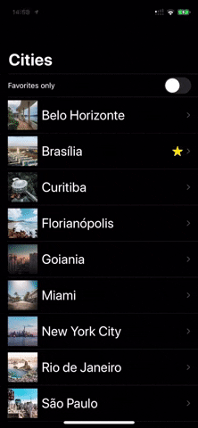

# Places SwiftUI

The project is compatible with **XCode 11.0** and **SwiftUI**.
Compatibility: Requires **iOS 13 or later**. Compatible with **iPhone and iPod touch**.

Application based on Swift UI showing some places I've been.

[v 1.0.0](https://github.com/lynnsouz/Places-SwiftUI/releases/tag/1.0.0)

[v 2.0.0](https://github.com/lynnsouz/Places-SwiftUI/releases/tag/2.0.0) Building Lists and Navigation.

[v 3.0.0](https://github.com/lynnsouz/Places-SwiftUI/releases/tag/3.0.0) Handling User Input.

