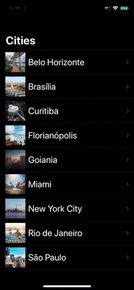
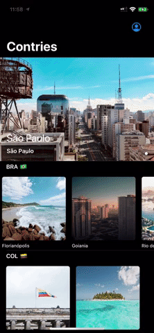
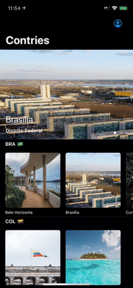

# Places SwiftUI

The project is compatible with **XCode 11.0** and **SwiftUI**.
Compatibility: Requires **iOS 13 or later**. Compatible with **iPhone and iPod touch**.

Application based on Swift UI showing some places I've been.

| [v 1.0.0](https://github.com/lynnsouz/Places-SwiftUI/releases/tag/1.0.0) | [v 2.0.0](https://github.com/lynnsouz/Places-SwiftUI/releases/tag/2.0.0) | [v 3.0.0](https://github.com/lynnsouz/Places-SwiftUI/releases/tag/3.0.0) |
| ------------------- | ------------------- | ------------------- |
| Starting project. | Building Lists and Navigation. | Handling User Input. |
|   |  |  |

| [v 4.0.0](https://github.com/lynnsouz/Places-SwiftUI/releases/tag/4.0.0) | Home Interface and UIKit interactions. |
| ------------------- | ------------------- |
| |  |
